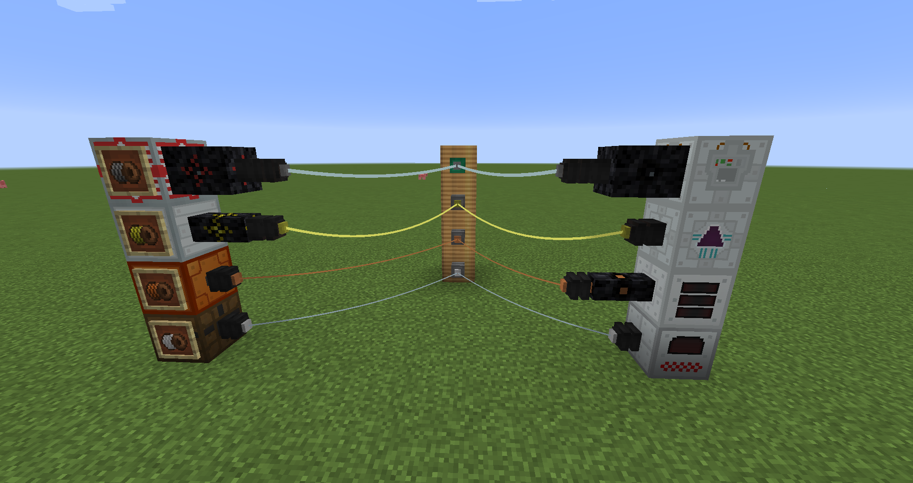

#Industrial Wires

An addon for Immersive Engineering. Some features, like the EU-transmitting IE-style wires the mod is named after, will only be enabled if IC2 is installed. All devices added by IndustrialWires can run of IC2 EU as well as ForgeEnergy/RF.

The features can be split into to groups: IC2 compat and HV/electronics stuff
 - IC2 compat:
   - IE style wires that transmit EU. Check the manual for recipes
   - Lossy converters between IE's rotational energy (windmills, watermills) and IC2's kinetic energy
 - HV/electronics:
   - [Control panels](https://www.youtube.com/watch?v=hV0cN20vCMY)
   - Jacob's ladders. They don't do anything useful apart from looking nice (Shown in the control panel video)
   - Marx generators. Ore processing using lightning/high voltage. You need to do a little bit of math to use it for that, but you can still use it to kill things/people without doing any!

The textures and models are partially modified IE resources and partially made by C8H8O4 or me.